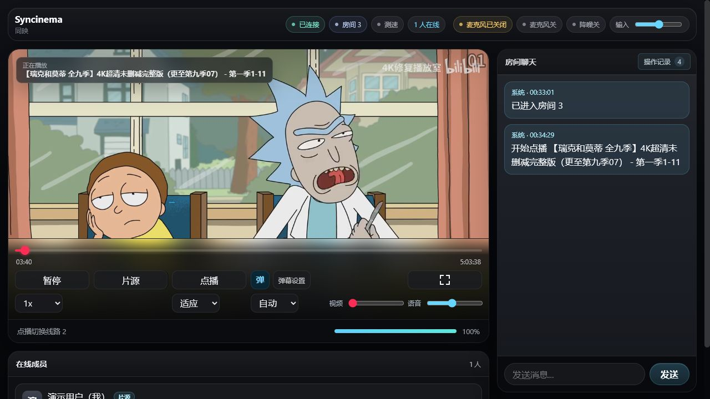
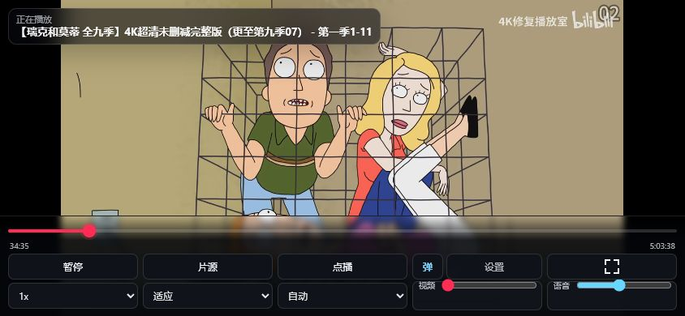
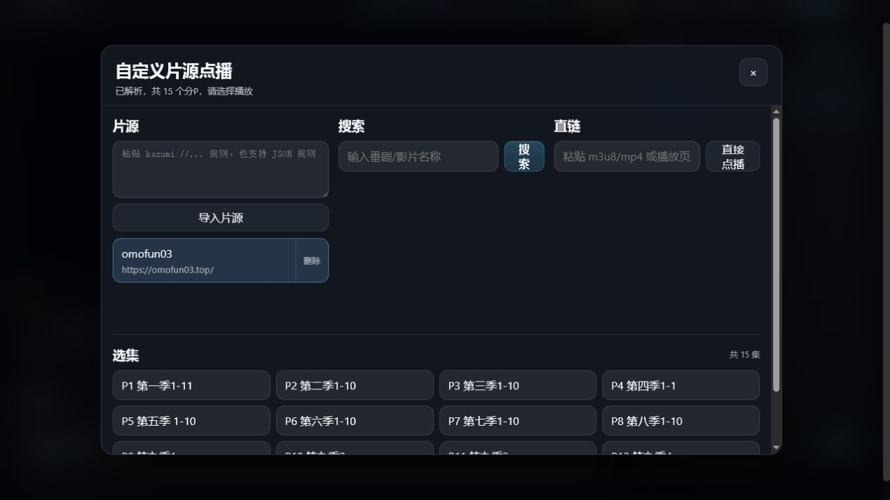

# Syncinema 同映

同映是一个可自行部署的多人同步观影应用，支持视频同步、房间聊天、消息弹幕、本地视频共享、语音通话、在线片源、哔哩哔哩点播与直播，以及移动端全屏控制。

## 功能

- 多房间独立的视频、用户、聊天和语音
- 播放、暂停、进度、倍速和画面比例同步
- 本地视频共享与在线片源点播
- 哔哩哔哩视频、分 P 视频和直播解析
- 房间聊天、消息弹幕和操作记录
- WebRTC 语音和敏感词管理
- 桌面端与移动端响应式控制栏

## 项目截图

### 桌面端播放器



### 手机横屏



### 在线片源



## 本地运行

需要提前安装 Node.js 20 或更高版本，推荐 Node.js 22。

```bash
git clone https://github.com/Ceylan233/syncinema.git
cd syncinema
npm run deploy
```

`npm run deploy` 会自动安装依赖、编译前端并启动服务。浏览器访问：

```text
http://localhost:3100/
```

## 服务器部署

服务器安装 Git 和 Docker 后执行：

```bash
git clone https://github.com/Ceylan233/syncinema.git
cd syncinema
docker compose up -d --build
```

部署完成后访问：

```text
http://服务器IP:3100/
```

查看日志或更新：

```bash
docker compose logs -f
git pull
docker compose up -d --build
```

## 环境变量

所有环境变量均为可选项，不填写即可按默认配置运行。

### 基础服务

| 参数 | 是否必须 | 说明 |
| --- | --- | --- |
| `PORT` | 可选 | 服务监听端口，默认 `3100` |
| `CORS_ORIGIN` | 可选 | 允许访问服务的网站来源，默认 `*` |
| `SENSITIVE_ADMIN_PASSWORD` | 可选 | 敏感词管理密码；留空时关闭管理入口 |

### 数据存储

| 参数 | 是否必须 | 说明 |
| --- | --- | --- |
| `CHAT_HISTORY_FILE` | 可选 | 房间聊天记录路径，默认 `server/chat-history.json` |
| `PLAYBACK_ACTIVITY_FILE` | 可选 | 播放操作记录路径，默认 `server/playback-activity.json` |
| `SENSITIVE_WORDS_FILE` | 可选 | 敏感词数据路径，默认 `server/sensitive-words.json` |

### WebRTC 与 TURN

| 参数 | 是否必须 | 说明 |
| --- | --- | --- |
| `ICE_SERVERS_JSON` | 可选 | 完整 ICE 配置，使用单行 JSON 数组 |
| `TURN_URLS` | 可选 | TURN 地址，多个地址使用英文逗号分隔 |
| `TURN_USERNAME` | 可选 | TURN 用户名 |
| `TURN_CREDENTIAL` | 可选 | TURN 密码 |

---

**`CORS_ORIGIN` 写法：** 需要包含协议和域名，例如 `https://syncinema.example.com`。保持 `*` 表示允许所有来源。

**`SENSITIVE_ADMIN_PASSWORD` 写法：** 直接填写自行设置的长密码。公开部署时不要使用示例密码。

**`TURN_URLS` 写法：** 单个地址直接填写；多个地址使用英文逗号 `,` 分隔，例如：

```text
turn:turn.example.com:3478?transport=udp,turn:turn.example.com:3478?transport=tcp
```

**`ICE_SERVERS_JSON` 写法：** 它与 `TURN_URLS`、`TURN_USERNAME`、`TURN_CREDENTIAL` 两种方式任选一种。填写 `ICE_SERVERS_JSON` 后，以 JSON 中的配置为准。

**数据文件路径写法：** 建议填写绝对路径。Docker 已自动使用数据卷保存这三类文件，通常不需要修改。

### Docker 填写方法

复制示例文件：

```bash
cp .env.example .env
```

然后编辑 `.env`。没有 TURN 服务时，保持 TURN 相关项目为空：

```dotenv
PORT=3100
CORS_ORIGIN=https://syncinema.example.com
SENSITIVE_ADMIN_PASSWORD=请替换为你自己的长密码

ICE_SERVERS_JSON=
TURN_URLS=turn:turn.example.com:3478?transport=udp,turn:turn.example.com:3478?transport=tcp
TURN_USERNAME=syncinema
TURN_CREDENTIAL=请填写TURN服务密码
```

保存后重新启动：

```bash
docker compose up -d --build
```

`.env` 已被 Git 忽略，不要把真实密码提交到公开仓库。

### Windows PowerShell 填写方法

环境变量只在当前 PowerShell 窗口中生效：

```powershell
$env:PORT="3100"
$env:CORS_ORIGIN="https://syncinema.example.com"
$env:SENSITIVE_ADMIN_PASSWORD="请替换为你自己的长密码"
$env:TURN_URLS="turn:turn.example.com:3478?transport=udp,turn:turn.example.com:3478?transport=tcp"
$env:TURN_USERNAME="syncinema"
$env:TURN_CREDENTIAL="请填写TURN服务密码"
npm run deploy
```

### Linux 填写方法

```bash
PORT=3100 \
CORS_ORIGIN='https://syncinema.example.com' \
SENSITIVE_ADMIN_PASSWORD='请替换为你自己的长密码' \
TURN_URLS='turn:turn.example.com:3478?transport=udp,turn:turn.example.com:3478?transport=tcp' \
TURN_USERNAME='syncinema' \
TURN_CREDENTIAL='请填写TURN服务密码' \
npm run deploy
```

### ICE JSON 示例

已经有完整 ICE 配置时，可以只填写 `ICE_SERVERS_JSON`，无需再填写 `TURN_URLS`、`TURN_USERNAME` 和 `TURN_CREDENTIAL`：

```dotenv
ICE_SERVERS_JSON=[{"urls":"stun:stun.example.com:3478"},{"urls":["turn:turn.example.com:3478?transport=udp","turn:turn.example.com:3478?transport=tcp"],"username":"syncinema","credential":"请填写TURN服务密码"}]
```

Docker 已将聊天记录、操作记录和敏感词数据保存在数据卷中，一般不需要修改三个文件路径变量。

公网正式使用时，请为域名配置 HTTPS；具体方法见 [HTTPS 部署说明](HTTPS.md)。

## iStoreOS / OpenWrt

先在 iStoreOS 应用商店安装 Docker，然后通过 SSH 执行：

```sh
wget -qO /tmp/install-syncinema.sh \
  https://raw.githubusercontent.com/Ceylan233/syncinema/main/deploy/istoreos/install.sh
sh /tmp/install-syncinema.sh
```

详细说明见 [iStoreOS 一键部署](deploy/istoreos/README.md)。

## 许可证

本项目采用 GNU Affero General Public License v3.0 许可证。请只共享你有权访问和传播的媒体内容，并自行遵守当地法律法规及第三方服务条款。
